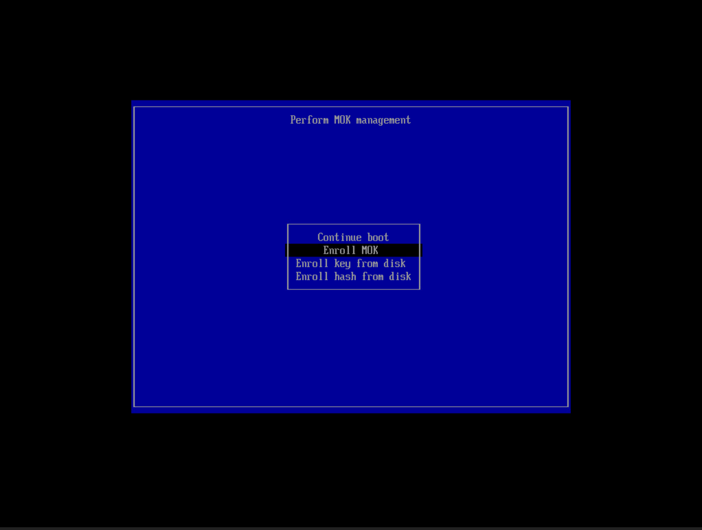
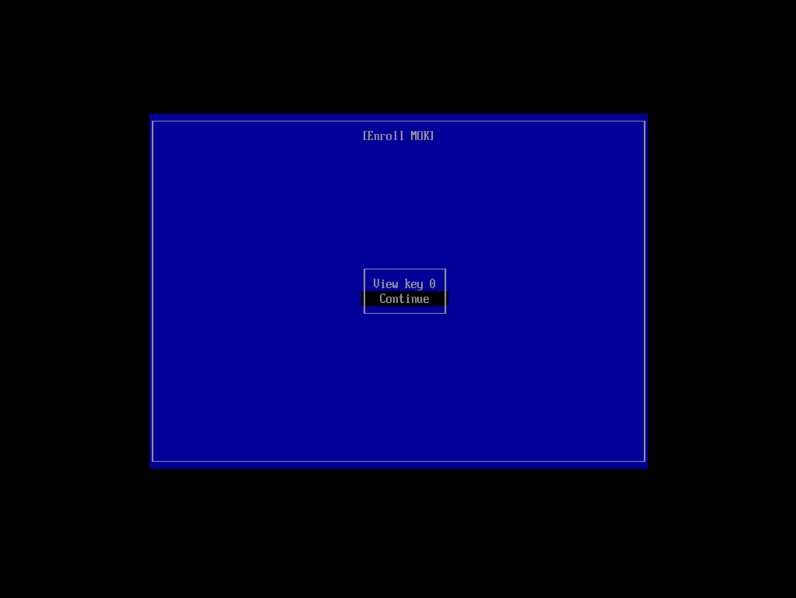

# 📑 MỤC LỤC
- [Mục 1: ESXi](#-mục-1-esxi) 
- [Mục 2: Ubuntu Linux](#-mục-2-ubuntu-linux)
- [Mục 3: Docker](#-mục-3-docker) 
- [Mục 4: Kubernetes](#%EF%B8%8F-mục-4-kubernetes) 

## 🖳 Mục 1: ESXi
### 1.1. Các lỗi ESXi:
1. Lỗi Kernel - do phần cứng bị thay đổi (Thay đổi Fan Speed, config trên ESXi,...)
    
    Vào Manage > Advanced Settings chỉnh VMKernel.Boot.vga thành True

2. Lỗi Failed - Invalid memory setting: memory reservation (sched.mem.min) should be equal to memsize(32768)

    Vào Edit của VM bị lỗi mở rộng phần Memory ra, set dòng Reservation dung lượng bằng dòng RAM

3. Lỗi Host bị icon cảnh báo màu vàng

    Vào Host > Actions chọn Exit maintainance mode

## 🐧 Mục 2: Ubuntu Linux
### 2.1. Tăng Disk Ubuntu:
```
echo 1>/sys/class/block/sda/device/rescan
cfdisk => Resize => Write => Quit
pvresize /dev/sda3
lvextend -l +100%FREE /dev/ubuntu-vg/ubuntu-lv
resize2fs /dev/mapper/ubuntu--vg-ubuntu--lv
```

### 2.2. Xóa log của lệnh docker logs:
`truncate -s 0 /var/lib/docker/containers/**/*-json.log`

### 2.3. Cài đặt NVIDIA GPU Driver:
#### 2.3.1. Xóa tất cả Driver cũ:
```
sudo apt-get purge nvidia-*
sudo apt-get update
sudo apt-get autoremove
```

#### 2.3.2. Tìm kiếm Driver khả dụng:
`apt search nvidia-driver`

#### 2.3.3. Cài Dependencies (tùy chọn):
```
sudo apt install libnvidia-common-470
sudo apt install libnividia-gl-470
```

#### 2.3.4. Cài đặt NVIDIA GPU Driver:
`sudo apt install nvidia-driver-470`

> Trong khi cài đặt Driver, Ubuntu Linux sẽ yêu cầu nhập mật khẩu khi process được khoảng 90%

#### 2.3.5. Reboot VM:
1. Chọn tùy chọn Enroll MOK


2. Chọn Continue


#### 2.3.6. Kiểm tra:
`nvidia-smi`

## 🐳 Mục 3: Docker
### 3.1. Cài đặt:
`curl -fsSL https://get.docker.com | sh`

### 3.2. Dockerfile Template:
#### 3.2.1. Dockerfile .NET:
```
FROM mcr.microsoft.com/dotnet/sdk:6.0 AS build
WORKDIR /app
# copy csproj and restore as distinct layers
COPY . .
RUN dotnet publish /app/Jhipster/ -c Release -o /app/publish

FROM mcr.microsoft.com/dotnet/aspnet:6.0
WORKDIR /app
EXPOSE 80
COPY --from=build /app/publish/* .
ENTRYPOINT ["dotnet", "jhipster.dll"]
```

## ☸️ Mục 4: Kubernetes
### 4.1. Cài đặt: 
#### 4.1.1. Cài Dependencies:
```
apt install -y socat
apt install -y conntrack
apt install -y ebtables
apt install -y ipset
```

#### 4.1.2. Cài Kubernetes:
```
curl -sfL https://get-kk.kubesphere.io | VERSION=v3.1.6 sh -
./kk create config --with-kubernetes v1.31.0
vi config-sample.yaml
./kk create cluster -f config-sample.yaml
```
